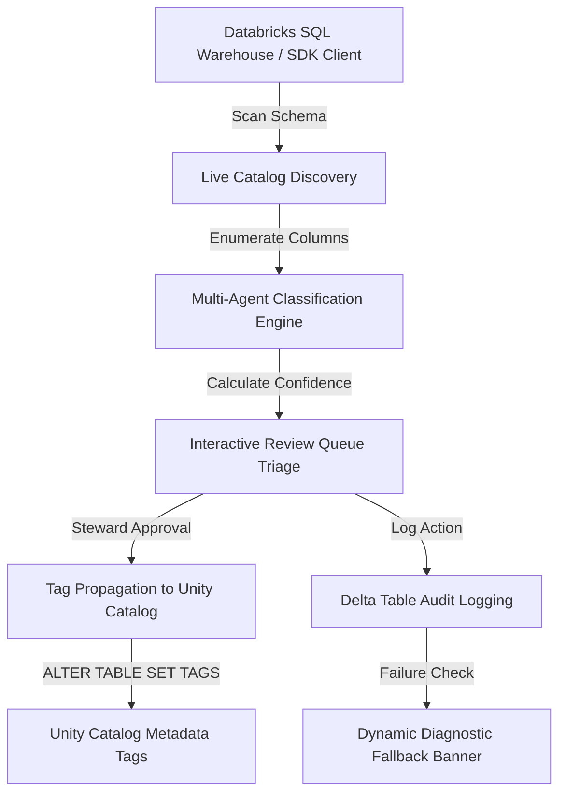

# Databricks Unity Catalog Integration & AI-Assisted Tag Classification Workflow

## Overview
As part of the Databricks Governance project, we integrated the custom **Governance App** (Streamlit portal) with the **Databricks Unity Catalog (UC)**. This integration enables automated, AI-assisted discovery, classification, and metadata tag propagation for sensitive column data (such as PII, PHI, and Financial data) across enterprise database tables.

The workflow spans catalog scanning, multi-agent tag consensus, interactive steward review, SQL-based tag enforcement in Unity Catalog, and an immutable audit trail.

---

## 1. Connecting to the Databricks Platform
The application establishes a secure connection to the Databricks environment using a dual-mode connector:

*   **Databricks SDK WorkspaceClient**: Used for control-plane operations (such as listing tables and columns, and retrieving active user metadata). When deployed as a **Databricks App**, it automatically authenticates using ambient container tokens.
*   **Databricks SQL Statement Execution**: Used for data-plane queries (like querying database rows, logging audit trails, and executing tag modifications). The application automatically discovers an active SQL Warehouse (`DATABRICKS_WAREHOUSE_ID`) and executes statements via the Databricks SDK REST API wrapper (`DatabricksSQLWrapper`).

> [!NOTE]
> When running inside a Databricks Notebook or Driver Node, the app automatically hooks into the local Spark session (`SparkSession`). In containerized Databricks Apps environment, it switches to the SDK Statement Execution API.

---

## 2. Live Catalog Discovery
The connection to Databricks allows the app to perform an automated scan of metadata inside targeted schemas:

1.  **Environment Scope Definition**: The app retrieves the target database catalog and schema from `DATABRICKS_CATALOG` (e.g., `dev`) and `DATABRICKS_SCHEMA` (e.g., `brz`).
2.  **Schema Enumeration**: Using the WorkspaceClient (`client.tables.list`), the app retrieves all tables inside the catalog schema (excluding core system tables).
3.  **Column Metadata Parsing**: The app inspects each column's name, data type (e.g. `STRING`, `DECIMAL`), and comments, compiling them into structured evaluation paths: `<catalog>.<schema>.<table_name>.<column_name>`.

---

## 3. Multi-Agent Tag Classification
Once columns are discovered, they pass through a rule-and-similarity classification engine to determine the correct security tag (e.g. `pii:ssn`, `phi:patient_id`, `financial:amount`):

*   **Detection Worker Agent**: Runs a native classifier comparing column name keywords against established enterprise data definitions (Regex and pattern matching).
*   **Ontology Lookup Agent**: Inspects business dictionary concepts to map column purposes to standard definitions.
*   **Similarity Worker Agent**: Scans catalog semantic vectors to find matching columns previously classified in other schemas.
*   **Composite Supervisor Decision**: Aggregates the findings of each worker, calculates a consolidated confidence score (0.0 to 1.0), and generates a triage recommendation (`Auto-Approve` or `Review Recommended`).

> [!TIP]
> The app loads pre-existing classifications directly from the `dev.brz.classification_results` table when available, preventing redundant scanning and maintaining consistency with past steward approvals.

---

## 4. Interactive Steward Triage
The discovered classifications are loaded into the **Review Queue** dashboard for human verification:

*   **Triage Interface**: Shows a clean, card-based interface detailing the source path, suggested tag type, priority level, and AI confidence metric.
*   **Bulk Decisions**: Stewards can check multiple rows and run `Bulk Approve` or `Bulk Reject` to apply policies to columns in bulk.
*   **Investigation Console**: Clicking an item reveals an exploration panel showing similar catalog columns, masked sample data, applied security policies, and the complete step-by-step AI decision lifecycle.

---

## 5. Metadata Tag Propagation (Unity Catalog)
Upon a steward's approval, the Governance App propagates the metadata tags directly back to Unity Catalog to enforce platform-wide data governance:

1.  The app compiles a Databricks SQL `ALTER TABLE` statement for the approved asset.
2.  The query is dispatched to the SQL Warehouse:
    ```sql
    ALTER TABLE dev.brz.patients ALTER COLUMN tax_identifier SET TAGS ('pii:ssn');
    ```
3.  Unity Catalog registers the tags instantly, rendering them visible in Databricks Catalog Explorer and enforcing any downstream row-level/column-level masking policies.

---

## 6. Diagnostic Logging & Audit Trail
Every action (automatic or manual) is recorded in an audit log to maintain compliance:

*   **Delta Storage**: Log records are stored inside a dedicated Delta table: `dev.brz.governance_audit`.
*   **Diagnostics Banner**: If writing fails due to privilege restrictions, a detailed diagnostic banner outputs the exact service principal ID of the app and the precise SQL error, alongside copy-paste queries for a Databricks Admin:
    ```sql
    GRANT USE CATALOG ON CATALOG `dev` TO `f48f2c1d-b921-49a9-b42c-42c1680e7510`;
    GRANT USE SCHEMA ON SCHEMA `dev`.`brz` TO `f48f2c1d-b921-49a9-b42c-42c1680e7510`;
    GRANT CREATE TABLE ON SCHEMA `dev`.`brz` TO `f48f2c1d-b921-49a9-b42c-42c1680e7510`;
    ```

---

## 7. Overall Workflow Diagram



---

## Deliverables
*   **Databricks Connection Wrapper**: Custom connector class (`utils/db.py`) handling Databricks SDK authentication, auto-warehouse discovery, and SQL statement execution.
*   **Governance Discovery Service**: Scanner logic (`services/governance_service.py`) loading live tables, column schemas, and existing classifications.
*   **Triage Interface Pages**: Unified, clean Streamlit pages with modern typography and soft shadows, replacing standard tables with contained-card lists.
*   **Compliance Audit Logger**: Delta logging service (`services/audit_service.py`) keeping track of steward decisions and displaying copy-paste administrative `GRANT` queries.
*   **Branding & Visuals**: Premium sidebar styling featuring custom SVGs and consistent layout rules across the app.
